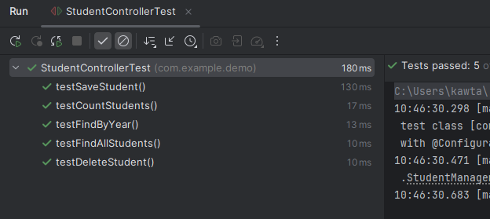

# Student Management 

## Test des Endpoints

Les tests des endpoints de l'application :

<table>
<tr>
<td>

**Test de l’ajout d’un étudiant (POST)**  

</td>
<td>

**Test de la récupération de tous les étudiants (GET)**  

</td>
<td>

**Test du comptage des étudiants (GET)**  

</td>
<td>

**Test du nombre d’étudiants par année de naissance (GET)**  

</td>
</tr>
</table>

---

## Test JUnit

Test unitaire effectué avec JUnit :  

---

## Swagger

Documentation et tests via Swagger :  

